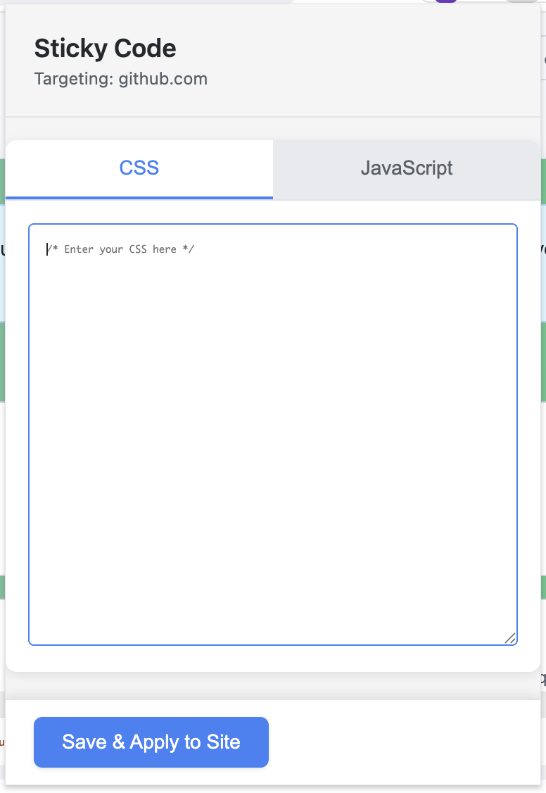

# Sticky Script

A Chrome extension that allows you to inject and persist custom CSS and JavaScript code on specific websites.



## Features

- **Per-Site Code Injection**: Set different CSS and JavaScript snippets for each website
- **Persistent Storage**: Your code is saved locally and automatically applied when you visit the site
- **Live Preview**: Changes are applied immediately after saving
- **Clean Tab Interface**: Separate tabs for CSS and JavaScript editing
- **Code Editor Features**: Tab key support (inserts 4 spaces) for better code formatting

## Installation

### From Source

1. Clone or download this repository
2. Open Chrome and navigate to `chrome://extensions/`
3. Enable "Developer mode" (toggle in top-right corner)
4. Click "Load unpacked"
5. Select the extension directory

## Usage

1. Navigate to any website where you want to inject custom code
2. Click the Sticky Script extension icon in your browser toolbar
3. Write your CSS or JavaScript code in the respective tabs:
   - **CSS Tab**: Add custom styles to modify the page appearance
   - **JavaScript Tab**: Add custom scripts that run when the page loads
4. Click "Save & Apply to Site" to apply your changes immediately
5. Your code will be automatically injected every time you visit that site

### Example Use Cases

**Custom Styling**:
```css
/* Hide annoying elements */
.advertisement {
  display: none !important;
}

/* Change background color */
body {
  background-color: #f0f0f0;
}
```

**Custom Functionality**:
```javascript
// Auto-scroll to bottom
window.scrollTo(0, document.body.scrollHeight);

// Log page load time
console.log('Page loaded at:', new Date().toLocaleTimeString());
```

## Known Issues

- **YouTube and Google Sites**: Due to Chrome's security policies, JavaScript injection is not possible on YouTube and other Google-owned websites (youtube.com, google.com, etc.). CSS injection may still work on these sites.
- **Internal Pages**: Cannot inject code into Chrome's internal pages (chrome://, edge://, about:, etc.)

## Permissions

This extension requires the following permissions:

- `activeTab`: To identify which website you're currently viewing
- `storage`: To save your custom code snippets
- `scripting`: To inject your code into web pages
- `tabs`: To manage and identify browser tabs
- `webNavigation`: To detect when pages are loaded
- `host_permissions (<all_urls>)`: To allow injection on any website you choose

## Development

### Project Structure

```
StickyExtension/
├── manifest.json       # Extension configuration
├── popup.html          # Extension popup interface
├── popup.js            # Popup logic and tab switching
├── content.js          # Code injection logic
├── background.js       # Background service worker
└── img/                # Extension icons, demonstration images, etc.
```

### Building

No build process required. This is a plain JavaScript extension ready to load directly into Chrome.

## License

MIT License - See [LICENSE](./LICENSE) for details

## Contributing

Contributions are welcome! Please feel free to submit a Pull Request.

## Privacy

All code snippets are stored locally in your browser using Chrome's storage API. No data is sent to external servers.

## Support

If you encounter any issues or have suggestions, please open an issue on the GitHub repository.
